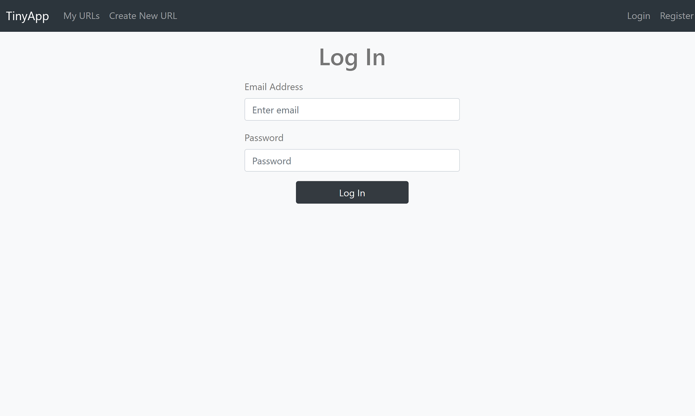

  

  <h3 align="center">TinyApp Project</h3>

  

   A web full-stack application for shortening links
  

  
Table of Contents

  <ul>
    <li>
      <a href="#about-the-project">About The Project</a>
      <ul>
        <li><a href="#dependencies">Dependencies</a></li>
      </ul>
    </li>
    <li>
    <a href="#project-details">Features</a>
    </li>
    <li>
    <a href="#getting-started">Getting Started</a>
      <ul>
        <li><a href="#how-to-use">How to Use</a></li>
      </ul>
    </li>
  </ul>

# Features
* User Authentication
* Link Shortener 
* List Of Shortened Links
* Link Update
* Link Deletion

# About The Project

 
 
TinyApp is a full stack web application built with Node and Express that allows users to shorten long URLs (à la bit.ly).
 
 

### Dependencies
* [Node.js](https://developer.mozilla.org/en-US/docs/Web/HTML)
* [Express](https://developer.mozilla.org/en-US/docs/Web/CSS)
* [bcrypt](https://developer.mozilla.org/en-US/docs/Web/JavaScript)
* [body-parser](https://jquery.com/)
* [cookie-session](https://jquery.com/)
 
 

# Getting Started
- Install all dependencies (using the `npm install` command).
- Run the development web server using the `node express_server.js` command.